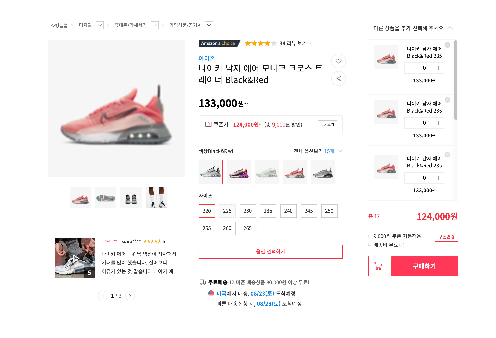
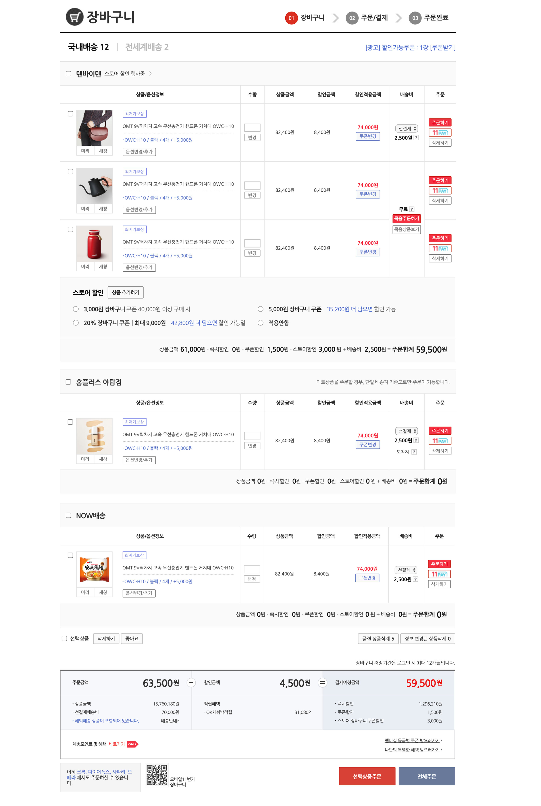
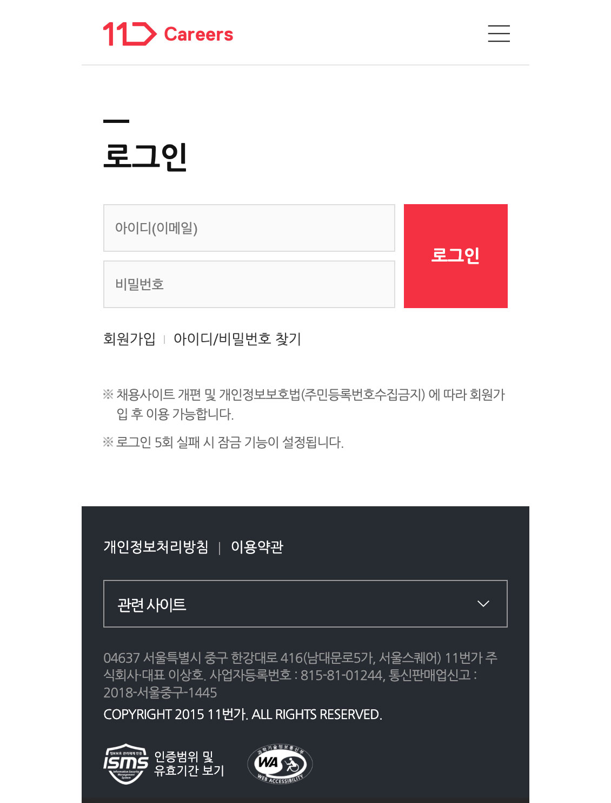

# 심주혜 웹 퍼블리싱 포트폴리오

11번가 서비스 화면(커머스 · 어드민 · 모바일)을 퍼블리싱한 작업물 모음입니다.

> 상품 · 아이콘 등 내부 이미지는 저작권 문제로 대체 이미지를 사용했습니다.

<br>

## 작업 목록

| 프로젝트                                                      | 구분   | 페이지                  | 작업 기간          | 기여도        |
| ------------------------------------------------------------- | ------ | ----------------------- | ------------------ | ------------- |
| [상품 상세](html/product_detail/option_selected.html)         | PC     | 메인 2개 타입           | 2021.08.08 – 08.20 | 퍼블리싱 100% |
| [장바구니](html/basket/basket.html)                           | PC     | 메인 + 쿠폰 윈도우 팝업 | 2021.06.15 – 06.28 | 퍼블리싱 100% |
| [상품 검색 결과](html/product_search/search_result.html)      | PC     | 메인                    | 2021.05.10 – 05.20 | 퍼블리싱 100% |
| [라이브 방송 등록 / 수정](html/live_broadcast/live_edit.html) | 어드민 | 팝업 2개 타입           | 2021.04.08 – 04.19 | 퍼블리싱 100% |
| [애드 오피스](html/ad_office/ad_office.html)                  | PC     | 메인                    | 2021.04.28 – 05.03 | 퍼블리싱 100% |
| [나의 11번가 SK pay point](html/my_wallet/sk_pay_point.html)  | PC     | 메인                    | 2021.03.16 – 04.06 | 퍼블리싱 100% |
| [11번가 채용 사이트](html/careers_mobile/main.html)           | 모바일 | 메인 + 서브 5           | 2021.09.12 – 09.23 | 퍼블리싱 100% |

<br>

## 미리보기

| 상품 상세                                                  | 장바구니                                                | 채용 사이트 (모바일)                                |
| ---------------------------------------------------------- | ------------------------------------------------------- | --------------------------------------------------- |
|  |  |  |

<br>

## 사용 기술

- **HTML5 / CSS3**
- **jQuery 3.1.1**: 탭, 아코디언 GNB, 수량 증감, 썸네일 갤러리, 토글 등 UI 인터랙션
- **Swiper 7**: 리뷰 슬라이더, 포트폴리오 썸네일 슬라이더

<br>

## 작업하며 신경 쓴 점

### 웹 접근성

- 모든 데이터 테이블에 `<caption>`, `scope`를 지정해 스크린리더가 표의 구조를 읽을 수 있도록 작성
- 아이콘만 있는 버튼은 `.blind` 텍스트나 `alt`로 대체 텍스트 제공
- `<label for>`로 폼 요소와 레이블 연결, 문서 언어 `lang="ko"` 지정
- 동작을 수행하는 요소(수량 증감, 삭제, 메뉴 열기/닫기, 저장 등)는 `<button type="button">`, 페이지 이동은 `<a>`로 구분

### 마크업 · 스타일

- CSS 속성 작성 순서 통일
  `display → overflow → float → position → width/height → padding/margin → border → background → color/font → animation`
- 페이지 단위로 CSS를 분리하고 공통 `reset.css`를 사용
- 별점은 퍼센트 width로 채우는 방식으로 구현해 점수에 따라 유연하게 표현

## 폴더 구조

```
11st/
├── index.html        # 포트폴리오 목록 페이지
├── html/             # 프로젝트별 페이지
├── css/              # reset.css + 페이지별 스타일
├── js/               # common.js(공통) + 페이지별 스크립트
└── img/
```
